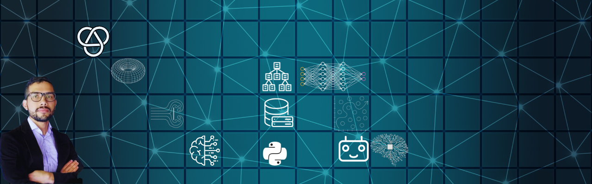

# Hi, I'm Brayan 👋

I'm an **Applied Mathematician** with a passion for building bridges between complex data and practical solutions. My work lives at the intersection of statistical learning, computer science, and business strategy.

### 🔭 What I'm Focused On

My primary interest is decoding the complex interactions between business logic, human behavior, and technical systems. I'm driven to find the right tools and theoretical frameworks to not just analyze these challenges, but to architect and implement effective, scalable solutions.

### 🌱 My Journey & Goals

This space is a reflection of my continuous learning journey. I'm constantly exploring new topics and technologies to broaden my problem-solving toolkit. I use GitHub to:
* Share my projects and experiments.
* Contribute to the open-source community.
* Connect with innovators and thinkers who share my passion.

### 📫 Let's Connect!

I'm always open to discussing new ideas, collaborating on projects, or just talking about tech. Feel free to reach out!

[LinkedIn](https://www.linkedin.com/in/brayan-mauricio-rodriguez-garzon/) | [Personal Website](https://sites.google.com/view/brayanmauricio/about-me) | [bramau901007@gmail.com](mailto:bramau901007@gmail.com)

